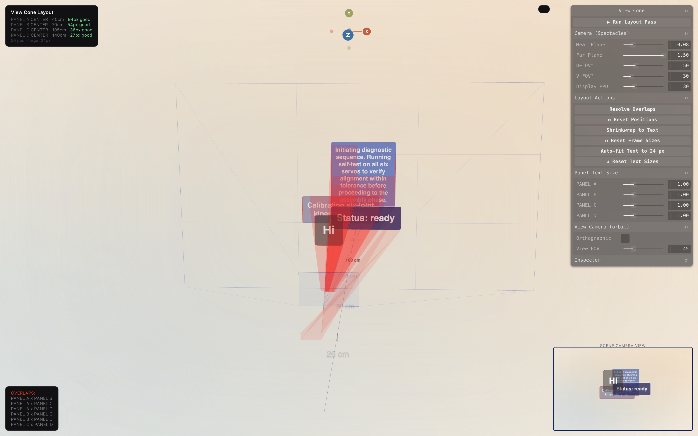
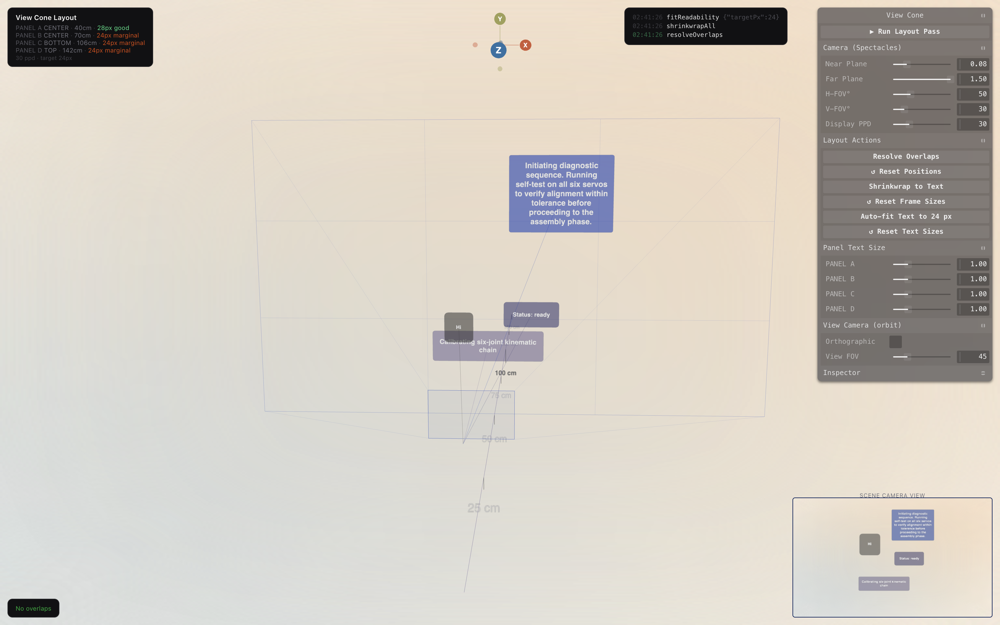

# view-cone-layout

Frustum-based spatial layout with overlap resolution for Lens Studio / Snap Spectacles.

Part of [`spatial-flex`](../..).

When you place panels in 3D space in front of the user, two panels at different depths can look fine in the editor and overlap completely from the wearer's point of view. `view-cone-layout` projects every panel into the user's angular space (azimuth and elevation), detects camera-perspective overlaps, and resolves them by pushing panels apart along the cheaper axis.

## Demo

| Before | After |
| --- | --- |
|  |  |

Four panels of varying text length sit at depths from 40 cm to 1.4 m. On the **left**, the inset bottom-right shows what the wearer actually sees: panels stacked into a single overlapping clump. On the **right**, after one **Run Layout Pass**, each panel's text has scaled toward the readability target, the frames have shrinkwrapped around the new text, and the panels have separated in angular space until no two overlap from the wearer's point of view.

To run the demo locally:

```bash
cd demo
npm install
npm run dev
```

Open http://localhost:5180.

## Install

Open the bundled Lens Studio project in `ViewConeLayout/`, or copy the layout scripts (and their `.meta` siblings) into your own project's `Assets/`:

```
YourProject/
  Assets/
    Layout/
      ViewConeLayout.ts
      ViewConeLayout.ts.meta
      ConeProjector.ts
      ConeProjector.ts.meta
      ConeSlot.ts
      ConeSlot.ts.meta
```

## Usage in Lens Studio

Attach `ViewConeLayout` to a parent SceneObject. Add a `ConeSlot` component to each child you want laid out. The layout component reads each slot's intended position, projects the bounds into angular space using `ConeProjector`, and writes back resolved positions that no longer overlap from the camera's view.

## How it works

1. **Project**: each slot's world bounds are projected to angular coordinates `(az, el)` and a depth.
2. **Detect**: pairwise rectangle overlap test in angular space.
3. **Resolve**: for every overlapping pair, compute the overlap on each axis. Push along the axis with smaller overlap (cheaper resolution). Iterate until no overlaps remain or a max-iterations cap is hit.

This runs cheaply because the math is rectangle-vs-rectangle in 2D; you can call it on every panel position change without breaking frame budget.

## License

MIT.
